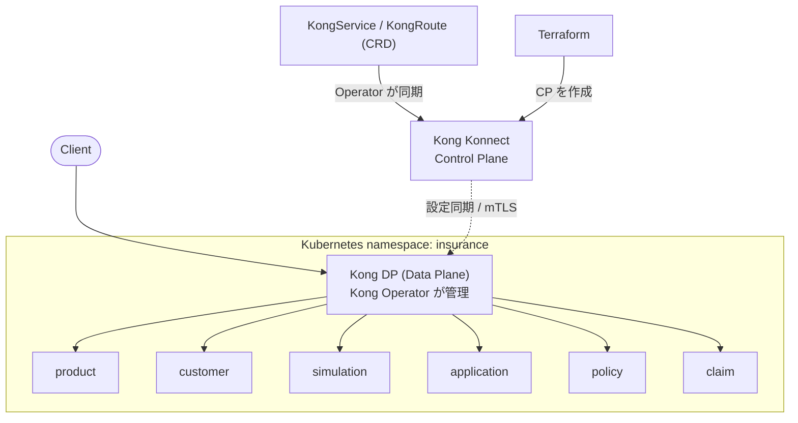

# Kong API Bundle — 損害保険ドメイン（デモAPIコンテナ）

損害保険会社を想定した6つの汎用デモAPIコンテナ（product / customer / simulation /
application / policy / claim）を公開しているリポジトリです。すべて日本語・日本の
データフォーマット(郵便番号・マイナンバー・電話番号など)に準拠したダミーデータで動作し、
各コンテナは単体でも `docker run` して手元で叩けます。イメージは GHCR
（`ghcr.io/picketfence-labs/insurance-<service>`）で公開しています。

## サービス構成

| サービス | 役割 | テストデータ | パス | OpenAPI Doc |
|---|---|---|---|---|
| **product** | 商品マスタ | 5件 | `/product` | [Docs](https://picketfence-labs.github.io/kong-api-bundle-insurance/api/product/) |
| **customer** | 顧客 | 100件 | `/customer` | [Docs](https://picketfence-labs.github.io/kong-api-bundle-insurance/api/customer/) |
| **simulation** | 保険料試算(ステートレス) | – | `/simulation` | [Docs](https://picketfence-labs.github.io/kong-api-bundle-insurance/api/simulation/) |
| **application** | 申込 | 300件（成立200／未成立100） | `/application` | [Docs](https://picketfence-labs.github.io/kong-api-bundle-insurance/api/application/) |
| **policy** | 契約 | 200件 | `/policy` | [Docs](https://picketfence-labs.github.io/kong-api-bundle-insurance/api/policy/) |
| **claim** | 保険金請求 | 50件 | `/claim` | [Docs](https://picketfence-labs.github.io/kong-api-bundle-insurance/api/claim/) |

商品ラインナップ（損害保険）: 火災保険 / 自動車保険 / 傷害保険 / 医療保険（第三分野） / ペット保険。

テストデータは全サービスをまたいで参照整合性が取れています（申込→契約→請求の連鎖、
商品カテゴリと請求種別の整合など）。詳細は [docs/DATA.md](docs/DATA.md) を参照してください。

> 「パス」列は、後述の Kong Gateway 経由フルデモ環境でのルートです。単体のコンテナを
> 直接叩く場合は各サービスの `/` 以下がそのままAPIのルートになります（OpenAPI Docを参照）。

## フルデモ環境（Kong Gateway + Konnect + Kubernetes）

上記6コンテナを **Kong Gateway Enterprise 3.15 + Kong Konnect** の背後に置き、
**Kubernetes**（ローカル検証は **Minikube**）上でゲートウェイ込みで動かすフルデモ構成も
用意しています。ゲートウェイは **Kong Operator** で管理します。詳細は
[フルデモ環境の構築手順](#フルデモ環境の構築手順) を参照してください。

## ドキュメント

- [docs/DATA.md](docs/DATA.md) — データモデル定義と設計判断の記録
- [docs/ARCHITECTURE.md](docs/ARCHITECTURE.md) — 全体構成・技術選定・ディレクトリ構成
- [docs/INSTRUCTIONS.md](docs/INSTRUCTIONS.md) — 環境構築の詳細手順（Minikube / Kong Operator / Konnect）
- [CLAUDE.md](CLAUDE.md) — 本リポジトリでの取り決め・作業方針

## 技術スタック

- **バックエンド**: Python 3.13 / FastAPI（OpenAPI 3.1 を自動生成）
- **API Gateway**: Kong Gateway Enterprise 3.15（Konnect Hybrid mode / Data Plane）
- **ゲートウェイ管理**: Kong Operator（`KonnectExtension` / `KongService` / `KongRoute` 等の CRD）
- **IaC**: Terraform（Kong/konnect provider で Control Plane を作成）
- **実行環境**: Kubernetes（ローカル検証は Minikube）
- **APIドキュメント公開**: GitHub Pages（[ADR 0009](docs/decisions/0009-openapi-doc-hosting.md)）

## フルデモ環境の構築手順

### アーキテクチャ概要



- **6サービス**は FastAPI 製で、Kubernetes の Deployment/Service として稼働。
- **Kong Gateway (Data Plane)** は Kong Operator が管理し、Konnect に hybrid mode で接続。
- **Service/Route** は Kong Operator の CRD（`KongService`/`KongRoute`）で定義し、Konnect に同期される。
- **Control Plane** は Terraform（`terraform/konnect`）で作成し、k8s からは Mirror として参照。

### クイックスタート（Minikube）

```bash
# 0. 前提: minikube 起動、kubectl / helm / terraform が利用可能
minikube start

# 1. テストデータ生成(data/seed/*.jsonは既にリポジトリにコミット済みのため通常は不要)
python3 scripts/generate_test_data.py

# 2. Kong Operator と Gateway API を導入(初回のみ)
./scripts/setup_kong_operator.sh

# 3. Konnect の Control Plane を Terraform で作成
export TF_VAR_konnect_pat=<Konnect Personal Access Token>
terraform -chdir=terraform/konnect init
terraform -chdir=terraform/konnect apply

# 4. Kubernetes へデプロイ(サービス + Kong DP + Route CRD)
# サービスイメージは GHCR(ghcr.io/picketfence-labs/insurance-<service>)からpull(既定タグ v0.1.1、ADR 0008)
export KONNECT_PAT=$TF_VAR_konnect_pat
./scripts/deploy_k8s.sh

# 5. 動作確認(プロキシ経由)
SVC=$(kubectl -n insurance get svc -o name | grep dataplane-ingress)
kubectl -n insurance port-forward "$SVC" 8080:80 &
curl http://localhost:8080/product/products
curl -X POST http://localhost:8080/simulation/simulations \
  -H 'content-type: application/json' \
  -d '{"product_id":"PRD-002","birth_date":"1990-01-01","sum_insured":3000000}'
```

詳細な手順・トラブルシューティングは [docs/INSTRUCTIONS.md](docs/INSTRUCTIONS.md) を参照してください。

## ディレクトリ構成

```
.
├── common/                # 全サービス共通モジュール（日本フォーマット・商品定義・保険料計算・ストア）
├── services/              # 6サービスのFastAPI実装（各 app/ + 共通 Dockerfile）
├── scripts/               # テストデータ生成・OpenAPI書き出し・イメージビルド・k8sデプロイ
├── data/seed/             # 生成されたテストデータ（JSON）
├── k8s/
│   ├── namespace.yaml
│   ├── services/          # 6サービスの Deployment / Service
│   └── kong/              # Konnect接続・Gateway・Route(CRD)
├── terraform/
│   └── konnect/           # Konnect Control Plane の IaC
├── docs/                  # ドキュメント
└── ...
```

## ライセンス / 注意事項

- 本リポジトリのデータはすべて **架空のダミーデータ** です。マイナンバー・氏名・住所・
  口座情報等は形式的に正しい値を機械生成したもので、実在の個人とは一切関係ありません。
