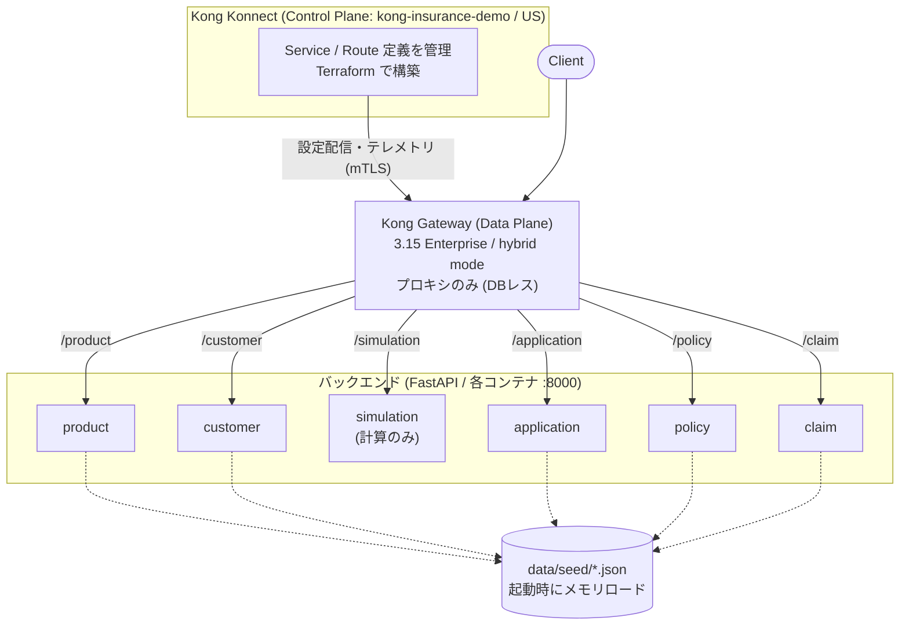

# アーキテクチャ

## 全体構成

- **Kong Konnect** が Control Plane。Control Plane 自体・Service / Route・DP証明書を Terraform で構築する。
- **Kong Gateway (Data Plane)** は hybrid mode で Konnect に接続し、設定を受け取ってプロキシに徹する（ローカルDBを持たない）。
- **6サービス** はいずれも FastAPI 製。ローカルでは同一 Docker ネットワーク内でサービス名解決され、DP からプロキシされる。

## 技術選定

| 項目 | 選定 | 理由 |
|---|---|---|
| 実装言語 | Python 3.13 / FastAPI | OpenAPI 3.1 を自動生成でき、Konnect へのスペック登録と相性が良い。CRUDデモの実装速度も速い |
| データ保持 | 起動時に JSON をメモリロード | デモ用途。DBを立てずに整合性の取れた固定データを提供でき、再起動でシードにリセットされる |
| Gateway | Kong Gateway Enterprise 3.15 (hybrid) | 要件。Konnect の Control Plane と接続する Data Plane として動作 |
| IaC / 宣言的管理 | Terraform (Kong/konnect provider) | Control Plane・Service・Route・DP証明書をコードで管理し、Konnect に冪等に反映。CP構築自体もTerraformで完結 |

## データモデルとサービス間整合性

- `product`(5) と `customer`(100) を基点に、`application`(300) がこれらを参照。
- 承認済み `application`(200件) が `policy`(200) に 1:1 で対応（`application_id` 必須）。
- `claim`(50) は有効な `policy` を参照し、請求種別は対象商品カテゴリと矛盾しない。
- `simulation` は永続データを持たず、`common.premium` の共通ロジックで `policy` の保険料と一貫した試算を返す。

詳細なフィールド定義・設計判断は [DATA.md](DATA.md) を参照。

## 共通モジュール (`common/`)

| モジュール | 役割 |
|---|---|
| `jp_data.py` | 日本フォーマット生成（郵便番号×都道府県×市区町村の実在組合せ、市外局番、マイナンバーのチェックデジット、銀行口座、氏名・カナ） |
| `products.py` | 商品マスタの単一情報源（product サービス・simulation・データ生成が共有） |
| `premium.py` | 保険料算出ロジック（simulation と契約保険料生成が共有し一貫性を担保） |
| `store.py` | JSONシードのメモリロード＋簡易CRUD（5つのCRUDサービスが共有） |

## サービス実装パターン

CRUD5サービス（product/customer/application/policy/claim）は同一構造:

- `common.store.JsonStore` でシードをロードし、`GET(list/detail)` `POST` `PUT` `DELETE` `GET /health` を提供
- Pydantic モデルでスキーマを定義（→ OpenAPI 3.1 に反映）
- 一覧は代表的な項目でのフィルタ＋`skip`/`limit` ページング

`simulation` のみ例外で、永続データを持たないステートレスな計算API（`POST /simulations`）。

## コンテナ構成

- 全サービスが単一の `services/Dockerfile` を共有し、ビルド引数 `SERVICE` で切り替える（ビルドコンテキストはリポジトリルート）。
- コンテナ内は `PYTHONPATH=/app`、`common/` と対象サービスの `app/`、`data/seed/` をコピー。
- シードファイルのパスは環境変数 `SEED_FILE` で指定（未指定時はリポジトリの `data/seed/<service>.json`）。

## ネットワーク / ポート

| 用途 | ローカルポート |
|---|---|
| product / customer / simulation / application / policy / claim | 8001〜8006 |
| Kong DP プロキシ (HTTP / HTTPS) | 8000 / 8443 |

DP は `--profile konnect` を付けたときのみ起動する（Konnect 接続情報が必要なため）。

## デプロイ方式

同じ6サービス + Kong DP を、2通りの方式で動かせる（どちらも選択可能なサンプル。片方が
ローカル専用/本番専用という位置づけではない）。手順は [INSTRUCTIONS.md](INSTRUCTIONS.md) を参照。

| | Docker Compose | AWS ECS (Fargate) |
|---|---|---|
| 定義 | `docker-compose.yml` | `terraform/ecs/` |
| サービス間解決 | Docker ネットワークのサービス名 | ECS Service Connect（discovery name = サービス名） |
| 公開 | ローカルポート / DP プロキシ(8000) | ALB → Kong DP → 各サービス |
| イメージ | ローカルビルド | ECR（`scripts/build_push_ecr.sh`） |
| DP 証明書 | `certs/` をボリュームマウント | Secrets Manager 経由で注入 |

どちらの方式でも、Kong の Service host（`product` 等）が同じ名前で解決される点が共通しており、
Konnect 側の Service/Route 定義（`terraform/konnect/`）を両方式で共有できる。

### AWS ECS 構成（`terraform/ecs/`）

- **VPC**: パブリックサブネット×2AZ。コスト最小化のため NAT Gateway は使わず、タスクにパブリックIPを付与して ECR/Konnect へアウトバウンド（受信はセキュリティグループで制限）。
- **ECS/Fargate**: 6バックエンドサービス + Kong DP を各 ECS Service として起動。
- **Service Connect**: バックエンドを discovery name（`product` 等）で公開し、Kong DP がクライアントとして `http://product:8000` で到達。
- **ALB**: Kong DP のプロキシポート(8000)を公開する入口。
- **Konnect 連携**: CP/TP エンドポイントは `terraform/konnect` の state を `terraform_remote_state` で参照。DP 証明書は `certs/` を Secrets Manager に格納して注入。

## 今後の拡張

- **認証プラグイン**: 現状は Service/Route のみ。key-auth / OIDC / rate-limiting 等を Terraform (`konnect_gateway_plugin`) で追加予定。
- **マイナンバーのマスキング**: 利用者ロールに応じた raw/masked 切り替え（現状は raw 返却）。
- **ECS のプライベート化**: 現状はコスト優先でパブリックサブネット構成。NAT Gateway + プライベートサブネット + VPC エンドポイントへの変更余地あり。
