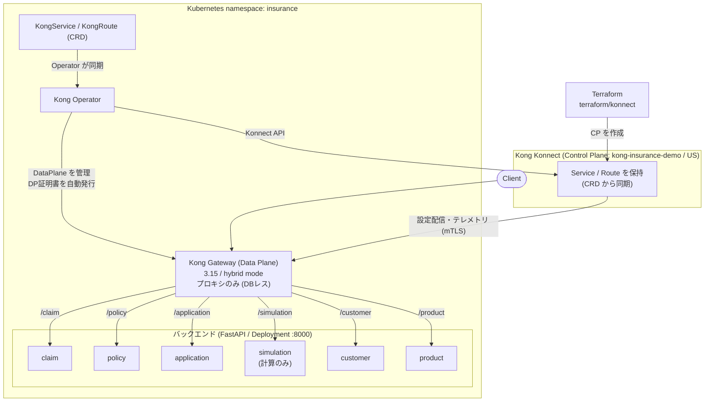

# アーキテクチャ

## 全体構成

- **Kong Konnect** が Control Plane。Control Plane 自体は Terraform（`terraform/konnect`）で作成し、k8s からは Mirror として参照する。
- **Kong Operator** が Kubernetes 上で Kong Gateway (Data Plane) を管理し、Konnect への接続（`KonnectExtension`）と DP クライアント証明書の自動発行を担う。
- **Service/Route** は Kong Operator の CRD（`KongService`/`KongRoute`）で定義し、Operator が Konnect へ同期。DP は Konnect から設定を受け取ってプロキシに徹する（DBレス）。
- **6サービス** はいずれも FastAPI 製の Deployment。同一 namespace 内の Service 名（`product` 等）で DP から解決される。

## 技術選定

| 項目 | 選定 | 理由 |
|---|---|---|
| 実装言語 | Python 3.13 / FastAPI | OpenAPI 3.1 を自動生成でき、Konnect へのスペック登録と相性が良い。CRUDデモの実装速度も速い |
| データ保持 | 起動時に JSON をメモリロード | デモ用途。DBを立てずに整合性の取れた固定データを提供でき、再起動でシードにリセットされる |
| Gateway | Kong Gateway Enterprise 3.15 (hybrid) | 要件。Konnect の Control Plane と接続する Data Plane として動作 |
| ゲートウェイ管理 | Kong Operator | Kubernetes ネイティブに DataPlane を管理。`KonnectExtension` で Konnect 接続、`KongService`/`KongRoute` CRD で Service/Route を宣言 |
| Control Plane の作成 | Terraform (Kong/konnect provider) | CP のライフサイクルは Terraform が所有。k8s からは Mirror で参照 |
| 実行基盤 | Kubernetes (ローカルは Minikube) | 要件。イメージは GHCR(`ghcr.io/picketfence-labs/insurance-<service>`)からpull（ADR 0007） |

## データモデルとサービス間整合性

- `product`(5) と `customer`(100) を基点に、`application`(300) がこれらを参照。
- 承認済み `application`(200件) が `policy`(200) に 1:1 で対応（`application_id` 必須）。
- `claim`(50) は有効な `policy` を参照し、請求種別は対象商品カテゴリと矛盾しない。
- `simulation` は永続データを持たず、`common.premium` の共通ロジックで `policy` の保険料と一貫した試算を返す。

詳細なフィールド定義・設計判断は [DATA.md](DATA.md) を参照。

## 共通モジュール (`common/`)

| モジュール | 役割 |
|---|---|
| `jp_data.py` | 日本フォーマット生成（郵便番号×都道府県×市区町村の実在組合せ、市外局番、マイナンバーのチェックデジット、銀行口座、氏名・カナ） |
| `products.py` | 商品マスタの単一情報源（product サービス・simulation・データ生成が共有） |
| `premium.py` | 保険料算出ロジック（simulation と契約保険料生成が共有し一貫性を担保） |
| `store.py` | JSONシードのメモリロード＋簡易CRUD（5つのCRUDサービスが共有） |

## サービス実装パターン

CRUD5サービス（product/customer/application/policy/claim）は同一構造:

- `common.store.JsonStore` でシードをロードし、`GET(list/detail)` `POST` `PUT` `DELETE` `GET /health` を提供
- Pydantic モデルでスキーマを定義（→ OpenAPI 3.1 に反映）
- 一覧は代表的な項目でのフィルタ＋`skip`/`limit` ページング

`simulation` のみ例外で、永続データを持たないステートレスな計算API（`POST /simulations`）。

## コンテナ構成

- 全サービスが単一の `services/Dockerfile` を共有し、ビルド引数 `SERVICE` で切り替える（ビルドコンテキストはリポジトリルート）。
- コンテナ内は `PYTHONPATH=/app`、`common/` と対象サービスの `app/`、`data/seed/` をコピー。
- シードファイルのパスは環境変数 `SEED_FILE` で指定（未指定時はリポジトリの `data/seed/<service>.json`）。
- Minikube を含むデプロイでは、`main`マージ時にGHCRへpushされた既存イメージ（`ghcr.io/picketfence-labs/insurance-<service>:<version>`）を`imagePullPolicy: IfNotPresent`でpullする（`scripts/deploy_k8s.sh`が`IMAGE_TAG`環境変数でタグを解決、既定`v0.1.0`。詳細: [ADR 0007](decisions/0007-minikube-deploy-image-source.md)）。未pushのローカルコード変更を試す場合のみ、`scripts/build_images_minikube.sh`でMinikubeのDockerデーモンに直接ビルドし`IMAGE_TAG=local`を指定する。

## Kubernetes 構成

すべて `insurance` namespace にデプロイする。手順は [INSTRUCTIONS.md](INSTRUCTIONS.md) を参照。

| 種別 | リソース | 定義 |
|---|---|---|
| バックエンド | 6サービスの Deployment + Service（各 :8000） | `k8s/services/` |
| Konnect 接続 | `KonnectAPIAuthConfiguration` / `KonnectGatewayControlPlane`(Mirror) / `KonnectExtension` | `k8s/kong/konnect.yaml` |
| Gateway | `GatewayConfiguration` / `GatewayClass` / `Gateway` | `k8s/kong/gateway.yaml` |
| Route | `KongService` / `KongRoute` ×6 | `k8s/kong/routes.yaml` |

要点:

- **サービス間解決**: Kong DP と6サービスは同一 namespace のため、`KongService.host = product` 等がクラスタ DNS（`product.insurance.svc`）で解決される。
- **DP 証明書**: `KonnectExtension.clientAuth.provisioning: Automatic` により Kong Operator が自動発行・Konnect 登録する（Terraform では扱わない）。
- **Control Plane の所有**: CP は Terraform が作成し、k8s の `KonnectGatewayControlPlane` は `source: Mirror` で ID 参照するのみ（ライフサイクルは Terraform 側）。
- **PAT Secret**: Kong Operator の Secret キャッシュはラベル `konghq.com/secret=true` で絞り込むため、PAT の Secret には必ずこのラベルを付ける。
- **公開**: DataPlane の ingress Service（LoadBalancer）が入口。Minikube では `minikube tunnel` か port-forward でアクセスする。

## 今後の拡張

- **認証プラグイン**: 現状は Service/Route のみ。key-auth / OIDC / rate-limiting 等を Kong Operator の `KongPlugin` CRD で追加予定。
- **マイナンバーのマスキング**: 利用者ロールに応じた raw/masked 切り替え（現状は raw 返却）。
- **クラウド Kubernetes**: ローカルは Minikube。EKS/GKE 等でも同じマニフェストで動作する想定（ingress の公開方法のみ環境依存）。
