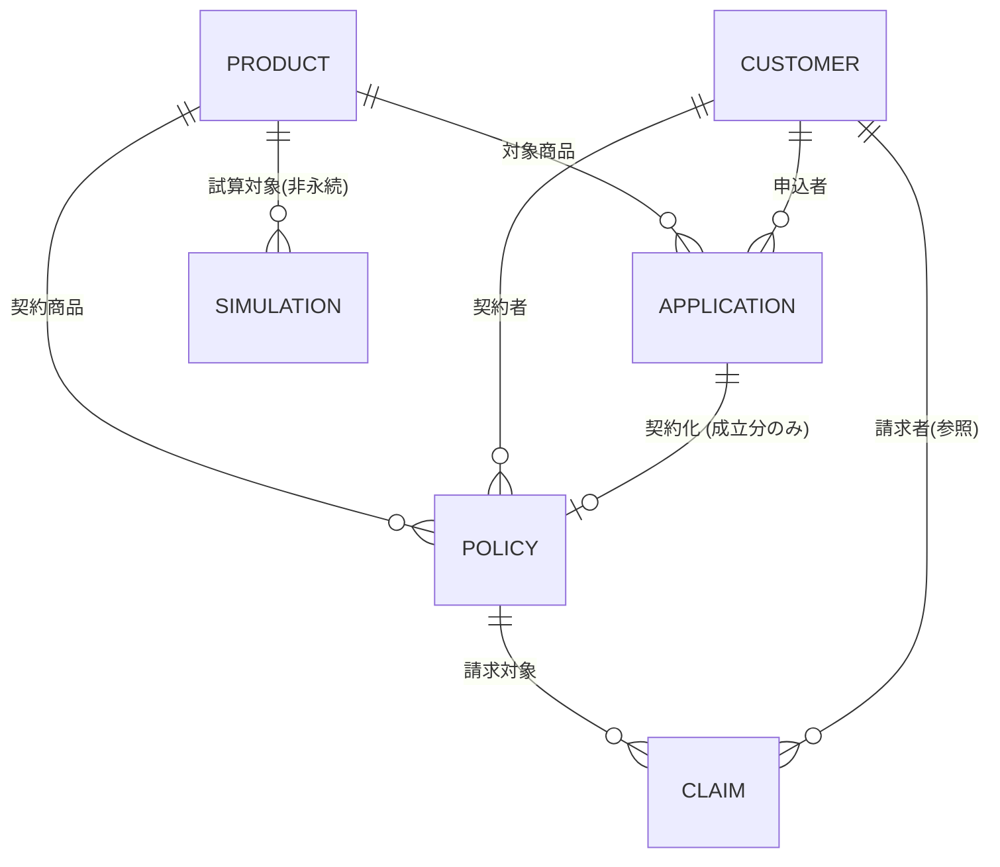

# データモデル v0.3（確定・実装ベース）

> **ステータス: 設計確定・実装着手**
> Kong Gateway Enterprise 3.15 + Kong Konnect を前段に置き、`product` / `simulation` / `customer` / `application` / `policy` / `claim` の6サービスをREST APIとして提供する構成のためのデータモデルです。確認事項1〜5すべてに回答をいただいたため、本バージョンを実装のベースラインとします。
>
> **v0.3の変更点（確認事項1〜4の反映）:**
> - application件数を150→**300件**に変更。うち200件は契約成立（policyに接続）、残り100件は審査中・却下等の未成立として保持（[確認事項1](#確認事項1--件数の整合性-回答済み)）
> - simulationは**計算のみ・永続化なし**のステートレスAPIとして確定（[確認事項2](#確認事項2--simulationサービスの性質-回答済み)）
> - マイナンバーは当面**フル桁をそのまま返却**。将来的に利用者の権限に応じてraw/maskedを切り替える方針（[確認事項3](#確認事項3--マイナンバーの公開範囲-回答済み)）
> - 実装言語は**Python/FastAPI**に確定（[確認事項4](#確認事項4--実装言語フレームワーク-回答済み)）
>
> v0.2の変更点（商品ラインナップ）は[確認事項5](#確認事項5--商品ラインナップ-回答済み)を参照してください。

## テストデータ規模（ドラフト）

| サービス | 役割 | 件数（ドラフト） | 備考 |
|---|---|---|---|
| product | 商品マスタ | 5 | 固定マスタデータ |
| customer | 顧客 | 100 | 個人顧客 |
| application | 申込 | 300 | うち200件は契約成立（policyに接続）、100件は審査中・却下等の未成立 |
| policy | 契約 | 200 | 全件が成立済みapplicationに紐づく（application_id必須） |
| claim | 保険金請求 | 50 | 有効契約への請求 |
| simulation | 保険料試算 | – | 計算のみ・永続化なし（ステートレスAPI） |

---

## 共通仕様・日本フォーマット

| 項目 | 仕様 |
|---|---|
| ID体系 | `<接頭辞>-XXXXXX`（ゼロ埋め連番）。例: `PRD-001`（商品は5件のみのため3桁） / `CUS-000001` / `APP-000001` / `POL-000001` / `CLM-000001` |
| 日付 | `YYYY-MM-DD`（ISO 8601）。例: `1985-04-12` |
| 日時 | `YYYY-MM-DDThh:mm:ss+09:00`（JSTを明示したISO 8601） |
| 郵便番号 | `\d{3}-\d{4}`。例: `150-0002`。実在する郵便番号帯から生成し、都道府県・市区町村と整合させる |
| 住所 | 都道府県 / 市区町村 / 番地・建物名 の3分割。JIS X 0401（47都道府県コード）に準拠し、郵便番号・都道府県・市区町村の対応を実データ相当に整備 |
| 電話番号 | 携帯: `0[789]0-\d{4}-\d{4}` / 固定: `0\d{1,4}-\d{1,4}-\d{4}` |
| マイナンバー | 12桁数字。総務省告示のチェックデジット算出方法に準拠したダミー値（実在の個人とは無関係）。現時点ではAPIでフル桁をそのまま返却。将来的に利用者の権限に応じてraw/maskedを切り替える予定（[確認事項3](#確認事項3--マイナンバーの公開範囲-回答済み)） |
| 性別 | 男性 / 女性 / その他 / 回答しない |
| 口座情報 | 銀行名・支店名・預金種別（普通/当座）・口座番号（7桁）。保険料引落・保険金振込に使用。口座番号は下4桁以外マスキング |

---

## ER図（サービス間の関係）

---

## サービス別データモデル

### product（商品）

5商品固定のマスタデータ。simulation・application・policyから参照されます。**損害保険会社を想定しているため、生命保険会社固有の商品である生命保険・学資保険は除外し、代わりに傷害保険・ペット保険を追加しました。** 医療保険（第三分野）は損保が直接引き受け可能な商品ですが、保険期間を生保的な「終身選択」から損保らしい掛け捨て・自動更新型に修正しています。

| ID | 商品名 | カテゴリ | 保障概要 | 加入年齢 | 保険期間 |
|---|---|---|---|---|---|
| PRD-001 | 火災保険「住まいの安心」 | 火災保険 | 火災・落雷・風災・水災 | 建物所有者（年齢制限なし） | 1〜5年 |
| PRD-002 | 自動車保険「ドライブセーフ」 | 自動車保険（任意） | 対人・対物・車両保険 | 18歳以上 | 1年（自動更新） |
| PRD-003 | 傷害保険「ケガの安心サポート」 | 傷害保険 | 入院・通院・後遺障害・死亡保障（急激・偶然な事故） | 0〜80歳 | 1年（自動更新） |
| PRD-004 | 医療保険「メディカルサポート」 | 医療保険（第三分野） | 入院・手術給付金 | 0〜75歳 | 1年（自動更新） |
| PRD-005 | ペット保険「わんにゃんメディカル」 | ペット保険 | 動物病院での診療費（入院・手術・通院） | ペット年齢0〜12歳 | 1年（自動更新） |

> ペット保険は被保険者が「人」ではなく「ペット」になる点が他商品と異なります。customer（契約者本人）は共通の顧客モデルを使用しつつ、application/policyに補助情報（ペットの種別・品種・年齢等）を追加する想定です。詳細は各サービスのフィールド定義を参照してください。

| フィールド | 型 | 必須 | 説明 |
|---|---|---|---|
| product_id **(PK)** | string | ○ | `PRD-001` 形式 |
| product_code | string | ○ | 社内商品コード（英数字） |
| product_name | string | ○ | 商品名（愛称含む） |
| category | enum | ○ | 火災保険 / 自動車保険 / 傷害保険 / 医療保険 / ペット保険 |
| description | string | ○ | 商品説明文 |
| coverage_summary | string | ○ | 主契約の保障内容概要 |
| min_age / max_age | integer | ○ | 加入可能年齢の範囲 |
| policy_term | string | ○ | 保険期間（例: "終身" "10年" "1年・自動更新"） |
| min_sum_insured / max_sum_insured | integer | ○ | 保険金額の設定可能範囲（円） |
| premium_rate_table | object | ○ | 年齢・性別等に応じた保険料算出係数（simulationサービスが参照） |
| riders | array | – | 付帯可能な特約一覧 |
| status | enum | ○ | 販売中 / 販売終了 |
| created_at / updated_at | datetime | ○ | 登録・更新日時 |

### customer（顧客）

100件の個人顧客。application・policy・claimから参照される中心的なマスタです。

| フィールド | 型 | 必須 | 説明 |
|---|---|---|---|
| customer_id **(PK)** | string | ○ | `CUS-000001` 形式 |
| last_name / first_name | string | ○ | 姓・名 |
| last_name_kana / first_name_kana | string | ○ | 姓・名（全角カタカナ） |
| birth_date | date | ○ | 生年月日 |
| gender | enum | ○ | 男性 / 女性 / その他 / 回答しない |
| my_number | string | ○ | マイナンバー12桁（ダミー・現時点ではフル桁をそのまま返却） |
| postal_code | string | ○ | 郵便番号 (NNN-NNNN) |
| prefecture / city / address_line | string | ○ | 都道府県 / 市区町村 / 番地・建物名 |
| phone_number | string | – | 固定電話番号 |
| mobile_number | string | ○ | 携帯電話番号 |
| email | string | ○ | メールアドレス |
| occupation | string | – | 職業 |
| annual_income | integer | – | 年収（円、告知情報として保険引受判断に使用） |
| bank_account | object | – | 銀行名・支店名・預金種別・口座番号（保険料引落用） |
| customer_since | date | ○ | 顧客登録日 |
| created_at / updated_at | datetime | ○ | 登録・更新日時 |

### simulation（保険料試算）

商品・顧客属性から保険料を試算するサービス。他5サービスと異なり固定件数のマスタを持たず、**入力に応じて都度計算するステートレスAPI**（永続化なし）として確定しました。

**入力**

| フィールド | 型 | 説明 |
|---|---|---|
| product_id | string (FK→product) | 試算対象商品 |
| birth_date | date | 年齢計算用 |
| gender | enum | 保険料係数に使用 |
| sum_insured | integer | 希望保険金額 |
| payment_period | string | 払込期間 |
| smoker_flag | boolean | 生命・医療保険の場合の喫煙有無 |

**出力**

| フィールド | 型 | 説明 |
|---|---|---|
| simulation_id | string | 試算結果の一時ID（履歴保持する場合） |
| monthly_premium | integer | 月額保険料（円） |
| annual_premium | integer | 年額保険料（円） |
| breakdown | object | 主契約・特約ごとの内訳 |

### application（申込）

300件。顧客が商品に対して行う申込データで、審査を経てpolicyに接続します。うち**200件は承認・契約成立**（resulting_policy_idが埋まる）、**残り100件は審査中・却下・取消などの未成立**として保持します。

| フィールド | 型 | 必須 | 説明 |
|---|---|---|---|
| application_id **(PK)** | string | ○ | `APP-000001` 形式 |
| customer_id | string (FK→customer) | ○ | 申込者 |
| product_id | string (FK→product) | ○ | 申込商品 |
| application_date | date | ○ | 申込日 |
| desired_sum_insured | integer | ○ | 希望保険金額 |
| desired_payment_period | string | ○ | 希望払込期間 |
| payment_method | enum | ○ | 口座振替 / クレジットカード / 団体扱い |
| health_declaration | object | – | 告知内容（医療保険・傷害保険のみ） |
| beneficiary | object | – | 受取人（氏名・続柄）※傷害保険（死亡保障）のみ |
| insured_pet | object | – | 被保険動物情報（種別・品種・年齢・名前）※ペット保険のみ |
| status | enum | ○ | 審査中 / 承認 / 却下 / 取消 |
| reviewed_at | datetime | – | 審査完了日時 |
| rejection_reason | string | – | 却下理由（却下時のみ） |
| resulting_policy_id | string (FK→policy) | – | 承認・契約化された場合の契約ID |
| created_at / updated_at | datetime | ○ | 登録・更新日時 |

### policy（契約）

200件。実際に成立している保険契約。証券番号を持ち、claimの対象になります。

| フィールド | 型 | 必須 | 説明 |
|---|---|---|---|
| policy_id **(PK)** | string | ○ | `POL-000001` 形式 |
| policy_number | string | ○ | 証券番号（対顧客向け表示番号） |
| application_id | string (FK→application) | ○ | 由来の申込（承認された申込と1:1で対応。nullなし） |
| customer_id | string (FK→customer) | ○ | 契約者 |
| product_id | string (FK→product) | ○ | 契約商品 |
| contract_date | date | ○ | 契約日 |
| effective_date | date | ○ | 保険始期日 |
| expiry_date | date | – | 保険終期日（終身の場合null） |
| sum_insured | integer | ○ | 契約保険金額 |
| premium_amount | integer | ○ | 保険料 |
| premium_payment_cycle | enum | ○ | 月払 / 年払 / 一括 |
| payment_method | enum | ○ | 口座振替 / クレジットカード / 団体扱い |
| status | enum | ○ | 有効 / 失効 / 解約 / 満期 |
| beneficiary | object | – | 受取人情報 ※傷害保険（死亡保障）のみ |
| insured_pet | object | – | 被保険動物情報（種別・品種・年齢・名前）※ペット保険のみ |
| riders | array | – | 付帯特約 |
| created_at / updated_at | datetime | ○ | 登録・更新日時 |

### claim（保険金請求）

50件。有効な契約（policy）に対する保険金請求データ。

| フィールド | 型 | 必須 | 説明 |
|---|---|---|---|
| claim_id **(PK)** | string | ○ | `CLM-000001` 形式 |
| policy_id | string (FK→policy) | ○ | 請求対象契約 |
| customer_id | string (FK→customer) | ○ | 請求者（policyから導出可・非正規化で保持） |
| claim_type | enum | ○ | 火災 / 自動車事故 / 入院 / 通院 / 手術 / 死亡（傷害） / ペット診療 等（商品カテゴリに連動） |
| incident_date | date | ○ | 事故・事由発生日 |
| claim_date | date | ○ | 請求日 |
| claim_amount_requested | integer | ○ | 請求金額 |
| claim_amount_paid | integer | – | 支払確定金額 |
| status | enum | ○ | 審査中 / 承認 / 支払済 / 却下 |
| description | string | – | 請求内容の詳細 |
| processed_at | datetime | – | 審査完了日時 |
| created_at / updated_at | datetime | ○ | 登録・更新日時 |

---

## テストデータ整合性方針

サービスをまたいだ参照整合性を、生成スクリプト側で以下のように担保する想定です。

- customer 100件、product 5件をまず確定 → application/policy/claimはこれらのIDのみを参照して生成
- application は300件生成し、うち200件をstatus=承認としてresulting_policy_idを持たせ、対応するpolicyを1件ずつ生成する。残り100件は審査中/却下/取消とし、resulting_policy_idはnullのまま
- policy の application_id・customer_id・product_id は元になったapplicationの内容と整合させ、審査承認された申込内容（希望保険金額・払込方法等）を契約内容に引き継ぐ（application_idは必須・nullなし）
- claim の policy_id は「有効」または請求時点で有効だった policy のみを対象とし、claim_type は対象商品のカテゴリと矛盾しないものにする（例: 火災保険の契約に「入院」請求は発生させない）
- 住所・郵便番号・都道府県は実在の組み合わせを使用し、電話番号・メールアドレスは氏名から機械的に矛盾なく生成する

---

## 確認事項（全件回答済み）

以下5点はすべて回答をいただき、本ドキュメントに反映済みです。今後の設計変更が生じた場合はこのセクションに追記します。

### 確認事項1 — 件数の整合性 ✅ 回答済み

**回答:** applicationを300件に変更。うち200件を契約成立（policy化）、残り100件を審査中・却下等の未成立として保持する。policyは全件が成立済みapplicationに1:1で紐づき、application_idは必須（nullなし）。

### 確認事項2 — simulationサービスの性質 ✅ 回答済み

**回答:** 計算のみ・永続化なし（DBを持たないステートレスAPI）。

### 確認事項3 — マイナンバーの公開範囲 ✅ 回答済み

**回答:** 当面はフル桁をそのままAPIで返却する。将来的に利用者の権限（ロール）に応じてraw/maskedの表示を切り替える機能を追加する想定（今回のスコープでは未実装）。

### 確認事項4 — 実装言語・フレームワーク ✅ 回答済み

**回答:** Python/FastAPIに確定。OpenAPIスキーマの自動生成をKonnectへの登録スペック作成に活用する。

### 確認事項5 — 商品ラインナップ ✅ 回答済み（v0.2で反映）

損害保険会社を想定しているため、生命保険・学資保険を除外し、傷害保険・ペット保険を追加。最終ラインナップは「火災保険・自動車保険・傷害保険・医療保険・ペット保険」の5商品（[product節](#product商品)参照）。
