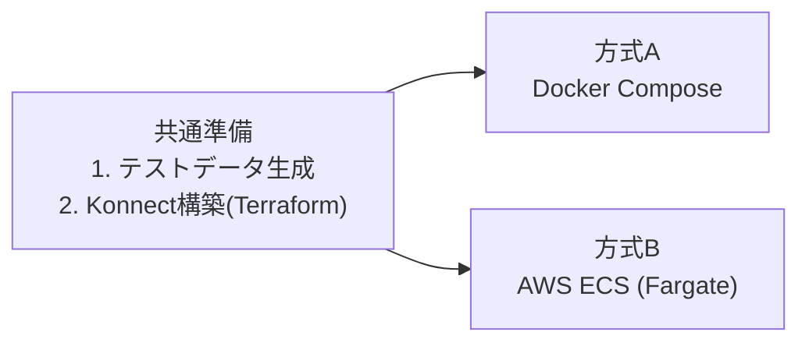
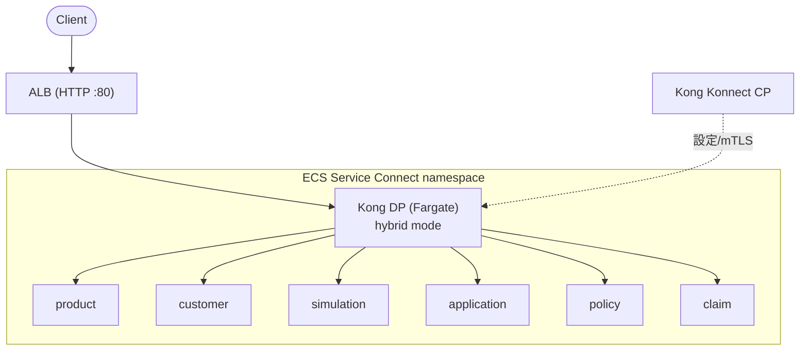

# 環境構築手順

本リポジトリは **2通りのデプロイ方式** をサンプルとして用意しています。どちらも
同じ6サービス + Kong Gateway (Data Plane) を動かすもので、目的に応じて選べます。
**「Docker Compose がローカル専用 / ECS が本番専用」という区分ではありません** —
どちらも試せる構成サンプルです。

- **[方式A: Docker Compose](#方式a-docker-compose)** — 1台のマシン上でコンテナ群を起動
- **[方式B: AWS ECS (Fargate)](#方式b-aws-ecs-fargate)** — AWS 上に Terraform で構築

いずれの方式でも、共通の準備（テストデータ生成・Konnect の構築）を先に行います。



---

## 0. 前提ツール

| ツール | 用途 | 方式A | 方式B |
|---|---|:--:|:--:|
| Python 3.11+ | テストデータ生成・OpenAPI書き出し | ○ | ○ |
| Terraform v1.5+ | Konnect / AWS の構築 | ○ | ○ |
| Kong Konnect アカウント + PAT | Control Plane 連携 | ○ | ○ |
| Docker / Docker Compose v2 | コンテナ実行・イメージビルド | ○ | ○ |
| AWS CLI v2 + 認証情報 | ECS へのデプロイ | – | ○ |

---

# 共通準備

## 1. テストデータの生成

初回、またはデータモデルを変更したときに実行します。乱数シードを固定しているため、
再実行しても同じデータが生成されます。

```bash
python3 -m pip install -r scripts/requirements.txt
python3 scripts/generate_test_data.py
```

出力: `data/seed/{product,customer,application,policy,claim}.json`
（simulation は永続データを持たないためファイルなし）

## 2. Kong Konnect の構築（Terraform）

Control Plane・Service・Route・Data Plane 証明書をすべて Terraform で構築します
（現状プラグインなし）。**方式A・B どちらでも共通** で必要です（Kong DP が接続する先）。

```bash
cd terraform/konnect

# PAT は環境変数で渡す(tfvars には書かない)
export TF_VAR_konnect_pat=<Konnect Personal Access Token>

terraform init
terraform plan     # 事前確認
terraform apply    # 反映
```

`terraform apply` で以下が作成されます:

- Control Plane `kong-insurance-demo`
- 6つの Service と Route（`/product` 〜 `/claim`）
- Kong Data Plane 接続用の自己署名証明書（リポジトリルートの `certs/tls.crt` / `tls.key` に出力し、Konnect に登録）

> リージョンが us 以外の場合は変数 `konnect_server_url` を `https://eu.api.konghq.com` などに
> 変更します（`terraform.tfvars` または `-var` で指定）。
> 設定変更は `.tf` を編集して再度 `terraform apply` するだけです。削除は `terraform destroy`。

---

# 方式A: Docker Compose

1台のマシン上で6サービスと Kong DP をコンテナとして起動します。

## A-1. 6サービスの起動

```bash
docker compose up -d --build
```

| サービス | 直接アクセス URL | Swagger UI |
|---|---|---|
| product | http://localhost:8001 | http://localhost:8001/docs |
| customer | http://localhost:8002 | http://localhost:8002/docs |
| simulation | http://localhost:8003 | http://localhost:8003/docs |
| application | http://localhost:8004 | http://localhost:8004/docs |
| policy | http://localhost:8005 | http://localhost:8005/docs |
| claim | http://localhost:8006 | http://localhost:8006/docs |

Kong DP を使わず、各サービスに直接アクセスして動作確認する例:

```bash
curl http://localhost:8001/products
curl "http://localhost:8005/policies?status=有効&limit=3"
```

## A-2. Kong DP を起動してプロキシ経由でアクセス

共通準備2の Terraform 出力から DP 接続情報を取得し、`.env` に記載します
（`.env.example` をコピーして編集）。証明書は共通準備2で `certs/` に生成済みです。

```bash
cd terraform/konnect
terraform output dp_env    # KONNECT_CP_ENDPOINT などが出力される
```

出力を `.env` に貼り付けます:

```
KONNECT_CP_ENDPOINT=xxxxxxxxxx.us.cp.konghq.com:443
KONNECT_CP_SERVER_NAME=xxxxxxxxxx.us.cp.konghq.com
KONNECT_TP_ENDPOINT=xxxxxxxxxx.us.tp.konghq.com:443
KONNECT_TP_SERVER_NAME=xxxxxxxxxx.us.tp.konghq.com
```

DP を起動（`--profile konnect`）:

```bash
docker compose --profile konnect up -d
```

プロキシ経由の確認:

```bash
curl http://localhost:8000/product/products
curl http://localhost:8000/customer/customers?limit=3
curl -X POST http://localhost:8000/simulation/simulations \
  -H 'content-type: application/json' \
  -d '{"product_id":"PRD-005","birth_date":"2022-01-01","sum_insured":500000}'
```

> ローカルの 8000/8443 が他プロセスで使用中の場合は、`docker-compose.override.yml` で
> ポートを変更できます（例: `8100:8000` / `8543:8443`）。

## A-3. 停止

```bash
docker compose --profile konnect down
```

---

# 方式B: AWS ECS (Fargate)

AWS 上に VPC・ECS クラスタ・6サービス・Kong DP・ALB を Terraform で構築します。
サービス間解決は ECS Service Connect を用い、Kong DP は `http://product:8000` の形で
バックエンドへプロキシします（Konnect の Service host 定義と一致）。



## B-1. 前提

- 共通準備1・2 が完了していること（`certs/` に DP 証明書があり、Konnect の state が `terraform/konnect/terraform.tfstate` にあること）
- AWS 認証情報が設定済みであること（`aws sts get-caller-identity` が通る）

## B-2. インフラの構築

まず ECR リポジトリ等を作成します。

```bash
cd terraform/ecs
terraform init
terraform apply
```

主な作成物: VPC / パブリックサブネット×2 / ECS クラスタ / ECR×6 /
Service Connect ネームスペース / 6サービス / Kong DP / ALB。

> Kong DP の証明書は共通準備2で生成した `certs/tls.crt`・`tls.key` を Secrets Manager 経由で
> 注入します。CP/TP エンドポイントは `terraform/konnect` の state から自動参照します。

## B-3. コンテナイメージのビルドと push

ECR リポジトリ作成後、イメージをビルドして push します。

```bash
# リポジトリルートで実行
./scripts/build_push_ecr.sh          # タグ latest
# ./scripts/build_push_ecr.sh v1     # タグ指定も可
```

push 後、ECS サービスに新イメージを反映（初回 apply 直後で既に最新なら不要）:

```bash
aws ecs update-service --cluster kong-insurance --service product --force-new-deployment
# 他サービスも同様に、または全サービスまとめて
```

## B-4. 動作確認

ALB の DNS 名は Terraform 出力で確認できます。

```bash
cd terraform/ecs
terraform output alb_dns_name

curl http://<alb_dns_name>/product/products
curl "http://<alb_dns_name>/customer/customers?limit=3"
curl -X POST http://<alb_dns_name>/simulation/simulations \
  -H 'content-type: application/json' \
  -d '{"product_id":"PRD-002","birth_date":"1990-01-01","sum_insured":3000000}'
```

## B-5. 破棄

```bash
cd terraform/ecs
terraform destroy
```

---

# 補足: OpenAPI 仕様の書き出し

各サービスの OpenAPI（`services/<service>/openapi.yaml`）を再生成します。
Konnect の API スペック登録や Dev Portal に利用できます。

```bash
python3 scripts/export_openapi.py
```

---

## トラブルシューティング

| 症状 | 対処 |
|---|---|
| `docker compose up` でポート競合 | 既存プロセスが 8000〜8006 を使用中。`lsof -iTCP:<port>` で確認し、`docker-compose.override.yml` でポート変更 |
| terraform apply（Konnect）で認証エラー | 環境変数 `TF_VAR_konnect_pat` と、リージョン(`konnect_server_url`) を確認 |
| DP が Konnect に接続できない | `.env`（方式A）または ECS タスクログ（方式B）で CP/TP エンドポイントを確認。`certs/` に証明書が生成済みか確認 |
| ECS の `terraform apply` で `certs/tls.crt` が無いエラー | 共通準備2（`terraform/konnect` の apply）を先に実行する |
| ECS でイメージ pull エラー | `./scripts/build_push_ecr.sh` を実行して ECR に push 済みか確認 |
| サービスが 500 を返す | `data/seed/*.json` が生成済みか確認（共通準備1）。コンテナ内では `SEED_FILE` を参照 |
