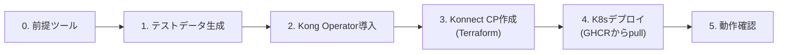

# 環境構築手順（Kubernetes / Minikube）

6サービスと Kong Gateway (Data Plane) を Kubernetes 上で稼働させます。ゲートウェイは
**Kong Operator** が管理し、Service/Route は Kong Operator の CRD で定義します。
Control Plane は Terraform で作成し、ローカル検証には Minikube を使います。



## 0. 前提ツール

| ツール | 用途 |
|---|---|
| Docker | (任意)ローカルコード変更をMinikubeで試す場合のみ必要 |
| minikube | ローカル Kubernetes |
| kubectl | Kubernetes 操作 |
| helm v3 | Kong Operator 導入 |
| Terraform v1.5+ | Konnect Control Plane 作成 |
| Python 3.11+ | テストデータ生成・OpenAPI書き出し |
| Kong Konnect アカウント + PAT | Control Plane 連携 |

```bash
minikube start   # 例: minikube start --driver=docker --cpus=4 --memory=6144
```

## 1. テストデータの生成

```bash
python3 -m pip install -r scripts/requirements.txt
python3 scripts/generate_test_data.py
```

出力: `data/seed/{product,customer,application,policy,claim}.json`。通常はリポジトリに
コミット済みの内容がGHCR公開イメージにも同梱されているため、この手順は既存データを
変更したい場合のみ必要です。

> **補足（デプロイ時のイメージ取得元）**: サービスイメージは `main` マージ時に GitHub
> Actions が自動で `ghcr.io/picketfence-labs/insurance-<service>:<version>`（および
> `:latest`）としてGHCRへpushしており（詳細: [design-brief.md](design-brief.md)）、
> 手順4（Kubernetesへのデプロイ）はこのGHCRイメージを直接pullします（ADR 0007）。
> Minikubeへのローカルビルドは不要です。未pushのローカルコード変更を試したい場合のみ
> `./scripts/build_images_minikube.sh` を実行し、`IMAGE_TAG=local ./scripts/deploy_k8s.sh`
> でデプロイしてください。

## 2. Kong Operator と Gateway API の導入（初回のみ）

```bash
./scripts/setup_kong_operator.sh
```

Gateway API CRD と Kong Operator（`kong/kong-operator` Helm チャート）を導入します。
導入済みの場合はスキップして構いません。

## 3. Konnect の Control Plane を作成（Terraform）

Control Plane のみを Terraform で作成します（Service/Route は手順4の CRD で管理）。

```bash
export TF_VAR_konnect_pat=<Konnect Personal Access Token>
terraform -chdir=terraform/konnect init
terraform -chdir=terraform/konnect apply
```

作成物: Control Plane `kong-insurance-demo`。ID は次で参照できます:

```bash
terraform -chdir=terraform/konnect output -raw control_plane_id
```

> リージョンが us 以外の場合は変数 `konnect_server_url` を変更します
> （`terraform.tfvars` または `-var`）。

## 4. Kubernetes へのデプロイ

```bash
export KONNECT_PAT=$TF_VAR_konnect_pat
./scripts/deploy_k8s.sh   # 既定でGHCRの v0.1.0 タグをpull(IMAGE_TAGで変更可)
```

`deploy_k8s.sh` は以下を行います:

1. `insurance` namespace と6サービス（Deployment/Service）を適用（イメージは`ghcr.io/picketfence-labs/insurance-<service>:${IMAGE_TAG:-v0.1.0}`からpull、ADR 0007）
2. Konnect PAT の Secret を作成（**ラベル `konghq.com/secret=true` が必須**）
3. Konnect 接続（`KonnectAPIAuthConfiguration` / Mirror の `KonnectGatewayControlPlane` / `KonnectExtension`）を適用。Control Plane ID は Terraform 出力から自動挿入
4. `KonnectExtension` が Ready になるまで待機（DP クライアント証明書は Operator が自動発行）
5. Gateway と Route（`KongService`/`KongRoute`）を適用

手動で行う場合の要点（`k8s/kong/konnect.yaml` 冒頭コメント参照）:

```bash
kubectl -n insurance create secret generic konnect-pat --from-literal=token=$KONNECT_PAT
kubectl -n insurance label secret konnect-pat konghq.com/secret=true konghq.com/credential=konnect
```

> **注意:** Secret に `konghq.com/secret=true` を付けないと、Kong Operator の Secret
> キャッシュが対象外とし `Secret not found` になります。

## 5. 動作確認

Kong DP のプロキシ Service に port-forward してアクセスします（Minikube では
LoadBalancer の EXTERNAL-IP は `minikube tunnel` 無しでは pending のままですが、
port-forward で確認できます）。

```bash
SVC=$(kubectl -n insurance get svc -o name | grep dataplane-ingress)
kubectl -n insurance port-forward "$SVC" 8080:80 &

curl http://localhost:8080/product/products
curl "http://localhost:8080/customer/customers?limit=3"
curl -X POST http://localhost:8080/simulation/simulations \
  -H 'content-type: application/json' \
  -d '{"product_id":"PRD-005","birth_date":"2022-01-01","sum_insured":500000}'
```

Konnect 上の Service/Route は次で確認できます:

```bash
kubectl -n insurance get kongservice,kongroute
```

## 補足: OpenAPI 仕様の書き出し

```bash
python3 scripts/export_openapi.py
```

各サービスの `services/<service>/openapi.yaml` を再生成します。

## 破棄

```bash
kubectl delete -f k8s/kong/routes.yaml -f k8s/kong/gateway.yaml
kubectl delete namespace insurance
terraform -chdir=terraform/konnect destroy   # Konnect Control Plane を削除
```

## トラブルシューティング

| 症状 | 対処 |
|---|---|
| `KonnectAPIAuthConfiguration` が VALID=False（`Secret not found`） | PAT Secret に `konghq.com/secret=true` ラベルが付いているか確認 |
| `KonnectExtension` が Ready にならない | `terraform output control_plane_id` と `konnect.yaml` の CP ID 一致、PAT の権限を確認 |
| DataPlane が Ready にならない | ingress Service（LoadBalancer）が pending でも DP Pod 自体は稼働。port-forward で確認可 |
| ルートが 404 | `kubectl -n insurance get kongservice,kongroute` で PROGRAMMED=True か、`paths` を確認 |
| Pod が ImagePullBackOff | GHCRパッケージが非公開の可能性（[ADR 0006](decisions/0006-package-visibility-automation.md)対応状況を確認）。ローカル変更を試す場合は `./scripts/build_images_minikube.sh` を実行の上 `IMAGE_TAG=local` を指定しているか確認 |
| サービスが 500 | `data/seed/*.json` を生成済みか（手順1）。イメージに同梱される |
