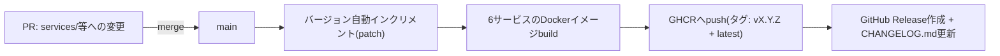

# Dev Design Brief — コンテナ化・パブリックレジストリ公開

Picketfence Labs Vault（Obsidianの管理ノート）の `Dev Design Brief Template` に沿って作成。本ドキュメントは、既存の6マイクロサービス実装にコンテナ公開・バージョニング・Change Log運用を後付けするための基本設計。着手前にVault側でヒアリング・確定した内容をここに転記している。

> **ステータス**: Harness定義段階（本PR）。実際のコンテナ化実装・CI構築は本PR以降の別タスクで行う。

## 1. Projectゴール
既存の6マイクロサービス（product/customer/simulation/application/policy/claim）を、パブリックコンテナレジストリ（GHCR）へバージョン管理・Change Log付きで公開できる状態にし、本リポジトリ以外のデモ・プロジェクトからも参照可能にする。

## 2. 要件

### 現在（今回のスコープ）
- 6サービスのコンテナイメージを `ghcr.io/picketfence-labs/...` 配下のパブリックレジストリへpush
- バージョニングは**リポジトリ全体で一括バージョン**（6サービス共通の単一バージョン番号。どれか1サービスの変更でも全イメージをまとめて再push・再タグ付けする）
- `main` へのmerge時に**自動で**バージョン（パッチ）更新・タグ付け・GHCRへのpushを実行するGitHub Actionsパイプラインを構築
- Change Logは**GitHub Release + `CHANGELOG.md`の併用**（バージョンタグに対応するGitHub Releaseを作成し、GHCRパッケージページからも辿れるようにする。`CHANGELOG.md`にも同内容を残す）
- Harness未導入状態からの後付け: CLAUDE.md更新、`.claude/settings.json`、`docs/decisions/`（ADR）、`docs/troubleshooting-log.md`、PR/ブランチ運用の導入

### 将来（今回はやらないが、設計上ぶつからないようにする）
- サービス毎の独立バージョニングへの移行可能性（今回は一括バージョンを選択したが、将来的にサービスが増えたり変更頻度の差が大きくなった場合に再検討する余地を残す。イメージ名はサービス毎に分離されているため、バージョニング方式のみの変更で対応できる設計にする）
- 非公開コンテナレジストリ（GCP Artifact Registry）との併用可能性（現時点では本リポジトリのイメージは全て公開想定のためGHCR一本化で問題ないが、将来非公開サービスが追加された場合はArtifact Registry側も使う可能性がある）
- マイナンバー等のraw/masked切り替え（既存CLAUDE.mdに記載済みの将来要件。本タスクのスコープ外だが、コンテナ公開によって外部からのアクセスが増える前提を踏まえ、公開判断に影響しないか留意する）

## 3. アーキテクチャ

**バージョニング方式**: リポジトリ全体で単一のバージョン番号を採用。判断基準: 現状6サービスは密結合な単一デモ環境として一体的にリリースされており、サービス毎の独立バージョニングは6種類のタグ運用・Change Log管理の複雑さに対して現時点でメリットが薄いという判断（詳細: [ADR 0001](decisions/0001-versioning-granularity.md)）。

**CIパイプライン概要**:

**レジストリ・命名**: 公開イメージはGHCR一本化（詳細: [ADR 0004](decisions/0004-container-registry-choice.md)）。イメージ名は既存のローカルタグ命名（`insurance-${svc}`）を踏襲し、`ghcr.io/picketfence-labs/insurance-<service>` とする想定（正式名称は実装タスクで確定）。

**判断ポイント・ADR**:
1. [0001: バージョニング粒度](decisions/0001-versioning-granularity.md) — リポジトリ全体で一括バージョン
2. [0002: Change Log方式](decisions/0002-changelog-method.md) — GitHub Release + CHANGELOG.mdの併用
3. [0003: リリース自動化トリガー](decisions/0003-release-automation-trigger.md) — mainマージ時の自動実行
4. [0004: コンテナレジストリの選定](decisions/0004-container-registry-choice.md) — GHCR一本化

## 4. 技術スタック
- 既存: Python/FastAPI（6サービス共通）、Docker（`services/Dockerfile`、`SERVICE`ビルド引数で切り替え、既存）
- 追加予定: GitHub Actions（バージョン自動更新・build・push・Release作成のワークフロー）、GHCR（`ghcr.io/picketfence-labs/...`）

## 5. 検証方法（テストケース）
- `main`マージ後、GitHub Actionsが自動でバージョンをインクリメントし、6イメージ全てがGHCRへpushされることを確認
- push後のGHCRパッケージページで、対応するGitHub Releaseが表示されることを確認
- `CHANGELOG.md`に新バージョンの変更内容が追記されていることを確認
- pushされたイメージが、本リポジトリ以外（別のデモ・プロジェクト）から `docker pull ghcr.io/picketfence-labs/insurance-<service>:<version>` で実際に取得できることを確認（GHCRのpublic可視性設定が正しく機能しているかの検証を含む）
- **外部依存の前提条件確認（着手前）**: publicリポジトリでのbranch protection可否をGitHub公式ドキュメントで確認する（社内の別プロジェクトのprivateリポジトリはGitHub Freeプランで403のため有効化不可だったが、本リポジトリはpublicのため制約が異なる可能性がある。思い込みで「今回も同じ制約」と判断しない）

## 6. 成果物
- 本PR（Harness定義）: CLAUDE.md更新、`.claude/settings.json`、`docs/decisions/`（ADR 0001〜0004）、`docs/troubleshooting-log.md`、branch protection（可能な範囲で）、PR/ブランチ運用ドキュメント
- （後続タスクの成果物）: バージョン管理ファイル（`VERSION`または`CHANGELOG.md`先頭）、GitHub Actionsワークフロー（build・push・Release作成）、GHCR上の6イメージ（初回push）

## 7. 関連する既存知見・参照先の棚卸し
- コンテナレジストリ・GHCR関連の知見は、この作業がVault側で最初の蓄積対象になる（既存の蒸留済み知見は無し）
- 公開/非公開レジストリの使い分け方針は、Picketfence Labsの別プロジェクト（GCPインフラ整備）で先行決定済みの内容をそのまま継承している

## 関連
- `CLAUDE.md` — 本リポジトリでの取り決め
- `docs/decisions/` — 本ブリーフの判断ポイントに対応するADR一式
- `docs/troubleshooting-log.md` — 実装中の想定外・知見ログ
